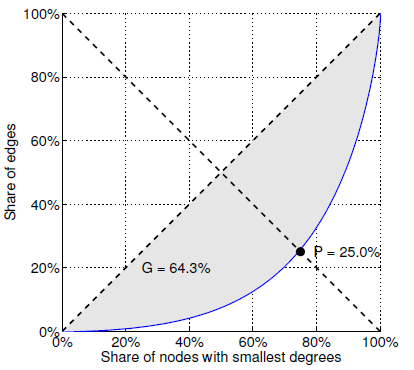
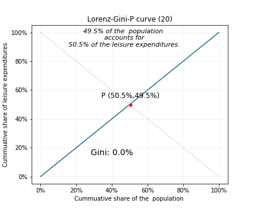
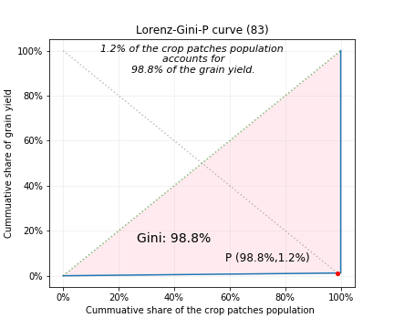
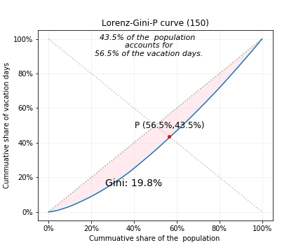
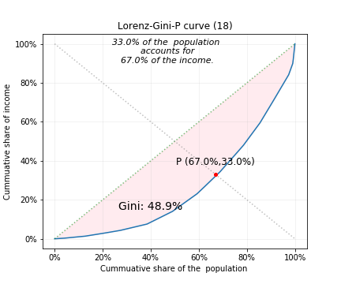

# LGP: the Lorenz-Gini-P curve

## A Lorenz Curve is a scatter plot of two series of cumulative proportions:
The x-axis records the cumulative proportion of some population (people, rabbits, defective widgets etc.) 
ranked by the cumulative proportion of an associated y-measure (income, births, cost of repairs, etc.).  
It is therefore, a square plot with (0,1) ranges.

To reproduce the "augmented" Lorenz curve (Figure 2) in this paper by Kunegis and Preusse, "Fairness on the Web: Alternatives to the Power Law" in *WebSci* 2012, June 22–24, 2012, Evanston, Illinois, USA::  

> Figure 2. Statistics associated with the Pareto principle. [...]The Lorenz curve (continuous line) gives rise to two statistics: The Gini coefficient G is twice the gray area and the balanced inequality ratio P is the point at which the antidiagonal crosses the Lorenz curve.

The 'the balanced inequality ratio P' that Kunegis and Preusse identify is typically used in a statement echoing the Pareto principle, e.g.: P% of all <users/objects> account for X% of all <some measures/resources...>.

# The Gini coefficient:  

## The Gini coefficient can be obtained graphically:  
The area below the diagonal is equal to half the total area of the square;  
It is also equal to the area between the diagonal and the Lorenz curve = A, 
plus what's left = B.  
Therefore, the Gini coefficient, G is:  G = A/(A+B)   
Since A+B = 0.5, **G = 2A**

# Examplar output of the function `LorenzGiniP.plot_lorenz_GP()`:  

## Gini = 0%: fair distribution of Y among X:  

  

## Gini = 100% when ~ 1 has ~ all: 
  

## Gini = intermedate for other cases:  
  

## This last plot was created from two cumulative series in a Pandas DataFrame:

### Hope this helps!

You can view the code in `./lgp_curve/LorenzGiniP.py`.  
The [Lorenz_Gini_P_curve notebook](./notebooks/Lorenz_Gini_P_curve.ipynb) has the coding details (imports, calls, etc.).
The Gini ratio was calculated using interpolation and integration: it will likely not be equal to the analyticaly calculated ratio; my guesstimate for the discrepancy is 0.05 to 0.1.

### Dependencies:  
* python 3.
* numpy
* scipy (for .integrate.trapz)
* pandas
* matplotlib

#### TODO: 
* Refine plotting function to pass style dict for plot text
* Refine plotting function to pass style dict for figure save options.
* Check discrepancy of Gini value viz analytical solution